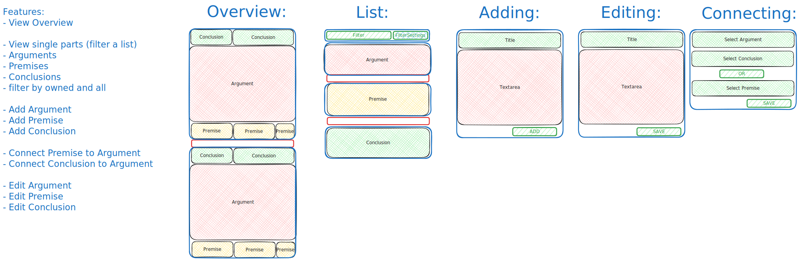

# Logic Website

## Description

 that allows users to create arguments and share them with others.
The arguments should be structured and formatted uniformly somehow.

## Goal

Have arguments entered by users with evidence/sources for each premise.
The conclusions can then be turned into predictions on real future events.
Those predictions need to somehow be verified with evidence.
This should result in a score for the user or the theory (weighted by the amount of predictions are made).

The score should be a measure of how well the user/theory is able to predict the future.
The highest weighted arguments/theories might then be used as fine tune training data for a language model.
The trained model could then be used to automatically sift through new arguments added by users and point out contradictions.
The AI model should of course have a score as well by predicting on future events.

## Structure




## Guidelines

### Single page app vs "traditional"
When to use href + hx-boost:
- When you want the url to change, so a decent change in the page.

When to use hx-get:
- When you want to get data from the server and update the page with it.

This can get confusing.
If you want to select a different article in a small box, one could just use hx-get.
But a user might want to share the link to the page with that article, so href + hx-boost might be better.

### OR
Always use hx-get/post/put/delete. If using hx-boost, make sure to use hx-select to specify hx-target and hx-select.
If the server redirects to a page with a normal boosted link, the request is still a hx-request.
Thus the partial template will be used, assuming one sets it up that way.
However the hx-boosted link replaces the whole body with the content, thus excluding navbar/footer and stuff.
On the other hand, if the recourse gets requested via a hx-get request (another button or non-boosted link), which specifies the hx-target and server doesn't check for hx-request, the target gets replaced by the whole page, which leads to inception of pages.
So be careful with redirects.
Either only use hx-boost, only hx-get/etc. or make sure all requests to a page you redirect to are either hx-boost or hx-get/etc (kinda seperating stuff).

### Ideas

Use hx-get everywhere.
Whenever there is a redirect, add serverside events to target the correct element (HX-Retarget, HX-Reswap, HX-Reselect).

Ok, nicest way might actually be to use HX-Location on the server after a post request. This issues a get request from the client to the defined location.
One quirk i found is that default target and SOURCE of that new get request is the body.
The target part is obvious and a normal default, but the source part creates a visual white flash of the whole page, because the body class gets adjusted.
This can be fixed by specifying the source on the HX-Location json response to a hidden element, i just put a hidden div with id="htmx-source" as the first element of the body.
I first tried to use 'a' as the element that triggers the request, but it uses a different link and flashes it.

### Htmx decorator

I created a decorator that creates an abstraction for the pattern of checking if the request is a hx-request and then returning a partial template or the full base template.
It requires to return the template and the context in a dict.
Not sure if there is a better solution.

# Deployment

On pythonanywhere, the following commands are used to deploy the website:

## Production

`makevirtualenv .venv` to create a virtual environment  
`pip install -r requirements.txt` to install the requirements  
`make css-prod` to compile tailwindcss  
`make env` to create the .env file (need to provide a SECRET_KEY)  
`flask --app flask_site init-db` to initialize the database  
`flask --app flask_site add-data` to reset the database to some test data  


The wsgi file (on pythonanywhere) needs to look like this:
```python
import sys
path = '/home/<username>/logic/flask_site'
if path not in sys.path:
    sys.path.append(path)

from wsgi import application
```

This imports the version controlled wsgi file, which exposes the SECRET_KEY from the .env file
to the local environment (not accessible, as env variable, from other scripts), creates the app and exposes the app.

## Test production locally
Just install `pip install gunicorn` in the virtual environment and run  
`gunicorn -w 4 flask_site:wsgi:application` OR  
`gunicorn -w 4 flask_site:create_app` (easier without using env SECRET_KEY)


## Issues
### CSRF
If I pass the CSRF token in the header of the body with hx-headers, it doesn't work after I log in (for logout).
Likely because logout refreshes the CSRF token, but the hx-headers doesn't update it for the logout request.
If i pass the CSRF token for every POST request in the hx-header separately, it works.
Probably works, because the logout button gets sent after logging in and now the more recent CSRF token is used for the logout request.
But this is not how it should work, I feel like.
The hx-headers from the body should propagate to all the elements and have the correct CSRF token.

